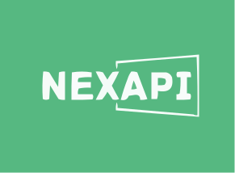

# NexAPI – N EXchanges API Library

NexAPI is a GO library that integrates official APIs from many well-known cryptocurrency exchanges.

## 🤷‍ What is NexAPI?

The NexAPI library is used to connect and trade with cryptocurrency exchanges and payment processing services worldwide. It provides quick access to market data for storage, analysis, visualization, indicator development, algorithmic trading, strategy backtesting, bot programming, and related software engineering.

It is intended to be used by coders, developers, technically-skilled traders, data-scientists and financial analysts for building trading algorithms.

## Usage

### Intro

### Binance Example

### Gate.io Example

## ⭐ Give a Star!

If you like or are using this project to learn or start your solution, please give it a star. Thanks!